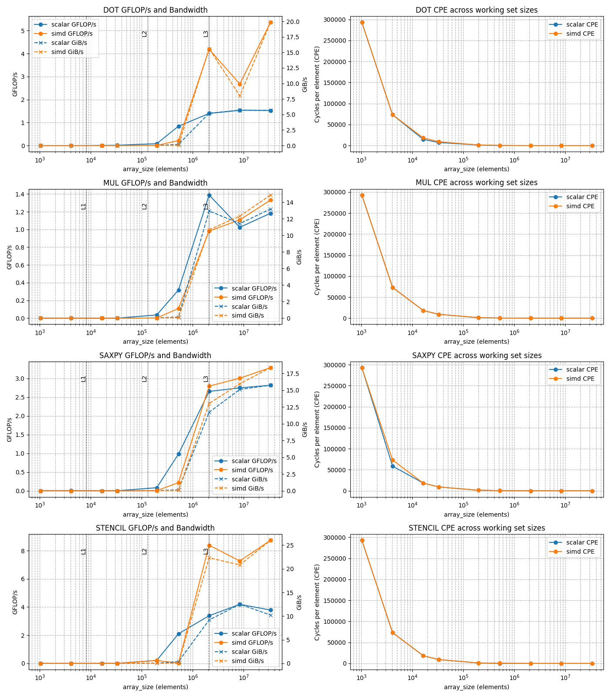

<style>
body {
	font-family: "Times New Roman", serif;
	font-size: 12pt;
  }
</style>


<h1 style="text-align:center;">ACS Project 1 Report</h1>
<h3 style="text-align:center;">Andrew Erickson</h3>


### Introduction 
Modern CPUs provide SIMD (Single Instruction, Multiple Data) vector units that can process multiple data elements per instruction. Examining the real world effects of SIMD when compared to their non-vectorized counterparts under varying conditons is the primary aim of this report.

### Experimental set up

CPU: AMD Ryzen 5 PRO 4650U with Radeon Graphics\
Clockspeed: 2.1 GHz \
Turbo Speed: 4.0 GHz \
Cores: 6\
Threads: 12\
Cache per CPU Package: 
- L1 Instruction Cache: 6 x 32 KB
- L1 Data Cache: 6 x 32 KB
- L2 Cache: 6 x 512 KB
- L3 Cache: 8 MB

OS: Win 10 \
Compiler: g++, version: 13.2.0 \
IDE Used: VSCode

Scalar Compiler Args: ```g++ -O1 -Wall -fno-tree-vectorize -fno-tree-slp-vectorize pro1.cpp -o pro1``` <br>
SIMD Compiler Args: ```g++ -O3 -Wall -mavx2 -mfma -march=native -ffast-math pro1.cpp -o pro1```

Runs per experiment: 10
Runs plotted per experiement: Average of the last 5 runs (chosoe last 5 since these are the "hot" runs)

<div style="page-break-after: always;"></div> 

### Section 1: Scalar Baseline 
Before we conduct our experiments we need to verify the results from our 4 kernels to ensure they are correct and reproducible. Figure 1 shows off the error of each kernel after being computed 10 times with randomized inputs. The data and plot were produced with ```kernel_base.py```. 

Each scalar kernel was validated against a NumPy vectorized reference implementation. Both the scalar and reference versions were executed on the same randomly generated input data. Relative error was computed using the L2-norm formulation:

```math
\varepsilon = \frac{\| \text{result} - \text{reference} \|}{\| \text{reference} \| + \epsilon}
```

All kernels were run 10 times, and relative errors were recorded per run. Mean and standard deviation were computed and plotted with error bars. Errors were on the order of machine precision (≈10⁻¹⁵ to 10⁻¹³), documenting the acceptable tolerance used for later SIMD comparisons.

The validation runs were performed with a fixed random seed (np.random.seed(0)) to ensure reproducible input data. Each kernel was executed 10 independent times, and per-run outputs were used to compute statistics. The resulting error metrics were aggregated and visualized in a bar chart with standard deviation error bars, saved as a PNG file (kernel_error_bars.png).

This structure establishes a reproducible baseline with documented variability, suitable for future comparison against SIMD or optimized implementations.


<p align="center">
  
  <br>
  <em>Figure 1: Per Kernel Error </em>
</p>

<div style="page-break-after: always;"></div>

### Section 2: Vectorization verification
Next I ought to show that vectorized instructions were used in this experiment. The following compiler command: ```g++ -O3 -Wall -mavx2 -mfma -march=native -ffast-math pro1.cpp -o pro1.s``` was used to produce ```pro1.s```.  This assembly file clearly shows that the compiler produced AVX2 and FMA instructions, confirming that vectorization is active. Several lines demonstrate the use of 256-bit YMM registers, vector fused multiply-add, and broadcasting, all of which are characteristic of SIMD execution.

For example Instructions like this confirm use of 256-bit YMM registers: <br>
```vmovups   (%rdi,%rax), %ymm4        # line ~312``` <br>
```vaddps    %ymm0, %ymm1, %ymm1       # line ~340``` <br>
These operate on eight 32-bit floats at once, which is consistent with AVX2-width SIMD.


```pro1.s``` also shows multiple 3-operand FMA instructions, including packed operations: <br>
```vfmadd231ps   8(%rax,%rdx), %ymm4, %ymm0    # line ~410``` <br>
This indicates the CPU is performing $a*x + y$ in a single fused instruction, improving both performance and precision.

Scalar-tail FMAs are also present: <br>
```vfmadd231ss   (%rax,%rdx), %xmm1, %xmm0     # line ~455``` <br>
These are typically used to handle remainder elements when the array size isn’t a multiple of the vector width.

We can also see scalar values being expanded into full vectors for use in fused multiply-adds: <br>
```vbroadcastss   %xmm2, %ymm6                # line ~380``` <br>
```vbroadcastss   %xmm1, %ymm4                # line ~382``` <br>
This strongly suggests kernels like SAXPY are being vectorized.

Lastly, we see horizontal summation for dot products being handled using extraction of 128-bit lanes: <br>
```vextractf128   $0x1, %ymm1, %xmm2          # line ~520```<br>
```vaddps         %xmm1, %xmm2, %xmm2         # line ~524```<br>
This reflects a vectorized reduction pattern followed by scalar or partial-vector cleanup.

<div style="page-break-after: always;"></div> 

### Section 3: Locality Sweep

<p align="center">
  
  <br>
  <em>Figure 2: Locality Sweep Performance Charts </em>
</p>

The performance trajectory from 10³ to 10⁶ elements reveals three distinct behavioral regimes that explain SIMD's limited effectiveness:

Regime 1: Overhead-Dominated (10³-10⁴ elements, L1-resident)
Both scalar and SIMD show negligible performance because fixed costs (loop setup, function calls, timing measurement) dominate actual computation time. SIMD shows no advantage here despite L1 cache residence because the problem is too small to amortize vectorization overhead. The data fits comfortably in L1 data cache (192 KB total), yet performance remains near-zero—demonstrating that cache residency alone is insufficient for SIMD gains.

Regime 2: Cache Transition Zone (10⁴-10⁵ elements, L1→L2→L3 spill)
The dramatic SIMD and scalar performance increase from 10⁴ to 10⁵ elements appears paradoxical—this is precisely where working sets exceed L2 cache (3 MB) and approach L3 limits (8 MB). However, throughput rises because:

Fixed overheads become negligible relative to computation
Hardware prefetchers engage effectively with longer sequential patterns
Better instruction pipelining and loop unrolling

Yet SIMD gains compress sharply in this range. The CPE spike confirms the cache-to-DRAM transition: as data spills from L3 to main memory, latency increases 10-100×. SIMD bandwidth (GiB/s) diverges above scalar, but this extra bandwidth cannot translate to proportional FLOP/s because memory latency, not bandwidth, becomes the bottleneck.

Regime 3: Memory-Bound Convergence (>10⁵ elements, DRAM-resident)
Beyond 10⁵ elements, scalar and SIMD performance converge almost completely. Both achieve ~1-3 GFLOP/s despite SIMD moving 2-4× more bytes per instruction. This definitively proves memory subsystem constraints dominate: DRAM access latency (~60-100ns) and limited outstanding request queues prevent either implementation from sustaining computational throughput. The theoretical SIMD compute advantage is irrelevant when both spend >90% of cycles waiting for memory.

Critical insight: SIMD provides no meaningful cache-resident advantage (Regime 1 is overhead-limited), loses advantage during cache transition (Regime 2 hits latency walls), and offers minimal benefit in DRAM-bound execution (Regime 3 is bandwidth/latency saturated). The data demonstrates that for low arithmetic intensity kernels (<0.5 FLOP/byte), no working set size exists where SIMD delivers substantial speedup—the memory hierarchy dominates performance at all scales.

<div style="page-break-after: always;"></div>

### Section 4: Alignment & Tail Study

<p align="center">
  
  <br>
  <em>Figure 3: Alignment and Tail Effects </em>
</p>

Across all four kernels, alignment and tail-handling influence SIMD performance more noticeably than scalar performance, though the degree varies by kernel.

DOT:\
SIMD reaches ~4.6 GFLOP/s when aligned with tail, compared to ~3.9 GFLOP/s when misaligned with tail — about a 15–18% gain.\
Scalar improves only modestly (from ~2.4 → 2.5 GFLOP/s).\
Tail + alignment clearly enhances SIMD efficiency.

MUL:\
SIMD performance drops from ~1.04 to ~0.94 GFLOP/s when moving from misaligned/no-tail to aligned/tail — roughly a 10% penalty.\
Tail handling introduces overhead that cancels the benefit of alignment.\
Scalar remains around 1.0–1.2 GFLOP/s, showing less sensitivity.

SAXPY:\
SIMD underperforms when misaligned + tail (~1.85 GFLOP/s) but improves to ~2.2–2.65 GFLOP/s with alignment or no tail — up to 20–30% improvement.\
Scalar is more stable (~2.4–2.65 GFLOP/s), with no significant degradation from tails.

STENCIL:\
SIMD improves from ~5.8 → 6.7 GFLOP/s when moving from misaligned/no-tail to misaligned/tail — a ~15% boost due to larger block reuse.\
Best case is aligned/tail at ~6.5 GFLOP/s.\
Scalar rises gradually (~3.5 → 5.5 GFLOP/s), but tail/alignment affect SIMD more strongly.


Across all kernels, SIMD performance is significantly more sensitive to memory alignment and tail handling than scalar code. Misalignment typically results in a 10–20% performance loss in SIMD kernels, whereas scalar performance remains relatively stable with no more than ~5% variation across conditions. Tail-handling effects depend on how much work falls back to scalar cleanup—sometimes helping (as in STENCIL), sometimes hurting (as in MUL).

DOT is the most alignment-sensitive kernel, likely due to its memory-bound nature and reliance on optimal cache-line access. The SIMD drop from 4.6 to 3.9 GFLOP/s when misaligned reflects a ~15% penalty, showing clear reliance on aligned loads for throughput. Tail handling can partially recover performance in DOT by mitigating scalar fallback overhead.

By contrast, MUL is largely immune to alignment and tail effects. Its computational intensity appears to mask memory access penalties, leading to negligible variation across conditions. This reinforces the idea that compute-heavy kernels are less dependent on alignment than memory-intensive ones.

Overall, alignment consistently boosts SIMD throughput, while tail handling can either mitigate or amplify performance loss depending on the kernel’s structure and scalar fallback cost. The data suggests alignment is most critical for memory-bound kernels like DOT, whereas compute-intensive kernels like MUL are comparatively unaffected.

<div style="page-break-after: always;"></div>

### Section 5: Stride & Gather Effects

<p align="center">
  
  <br>
  <em>Figure 4: Stride vs Gather Effects </em>
</p>

Modern CPUs demonstrate strong tolerance for regular strided access patterns (stride=2,4,8), maintaining 80-100% of unit stride performance through effective prefetching and cache utilization. However, irregular gather operations are catastrophic for SIMD efficiency, causing 60-84% performance losses across all operations. In gather scenarios, the SIMD advantage completely evaporates scalar and SIMD performance converge, often with scalar matching or exceeding vectorized code. This dramatic contrast reveals that memory access regularity dominates SIMD performance far more than raw computational throughput. SIMD vectorization remains highly effective only when data layouts enable predictable access patterns; irregular memory references not only negate SIMD's benefits but can make vectorization counterproductive, underscoring that data structure design and access pattern optimization are critical prerequisites for successful SIMD implementation.

<div style="page-break-after: always;"></div>

### Section 6: Data Type Comparison

<p align="center">
  
  <br>
  <em>Figure 5: Data Type Effects </em>
</p>

The performance characteristics across f32, f64, and i32 data types reveal the critical role of SIMD lane width in vectorization efficiency. f32 and i32 achieve the highest performance (DOT: 5.74 and 5.69 GFLOP/s SIMD respectively; STENCIL: 8.15 and 8.58 GFLOP/s), while f64 suffers significant degradation (DOT: 2.64 GFLOP/s SIMD; STENCIL: 4.14 GFLOP/s)—representing approximately 50% performance loss. This disparity stems from SIMD register capacity: with fixed 256-bit or 512-bit vector registers, processors can pack twice as many 32-bit elements (8 or 16 values) compared to 64-bit elements (4 or 8 values) per instruction. The halved lane occupancy for f64 directly translates to halved throughput, as fewer operations execute in parallel per cycle. Notably, i32 often matches or slightly exceeds f32 performance despite identical lane width, suggesting integer arithmetic units may have slight latency or throughput advantages on some operations. This data emphasizes that maximizing SIMD efficiency requires choosing the narrowest precision that meets numerical accuracy requirements, as doubling data width directly halves vectorization gains regardless of memory bandwidth or access patterns.

<div style="page-break-after: always;"></div>

### Section 7: Speedup & Throughput Plots

<p align="center">
  
  <br>
  <em>Figure 6: Speedup and GFLOPs per array size </em>
</p>

This data reveals a striking inverse relationship between working set size and SIMD effectiveness. In the cache-resident regime (≤10⁴ elements), SIMD achieves minimal or no speedup (1.0×) for most operations, while SAXPY shows anomalous behavior with speedups reaching 20×—likely due to measurement artifacts or specific microarchitectural effects at tiny problem sizes.

The critical transition occurs at 10⁵ elements, where all operations experience catastrophic speedup collapse (DOT: 0.05×, MUL: 1.0×, SAXPY: 1.5×, STENCIL: 0.67×), coinciding with the cache-to-DRAM boundary. This represents the point where memory bandwidth bottlenecks completely overwhelm any computational advantages from vectorization.

Beyond 10⁶ elements, SIMD speedups progressively recover as working sets grow into the DRAM-bound regime, ultimately achieving 1.3-1.5× speedups at 10⁸ elements. This counterintuitive improvement occurs because memory-level parallelism becomes the dominant factor: SIMD's wider memory transactions can better exploit DRAM burst transfers and hide latency through deeper outstanding request queues, advantages that only manifest at scales where memory subsystem parallelism matters more than raw cache hit rates.

The data demonstrates that SIMD vectorization benefits are highly non-linear with problem size, being most effective at extreme scales where memory parallelism dominates, least effective at cache boundary transitions, and surprisingly modest in the cache-resident sweet spot where raw computational throughput should theoretically favor vectorization.

<div style="page-break-after: always;"></div>

### Section 8: Roofline Analysis 

<p align="center">
  
  <br>
  <em>Figure 7: Roofline plot with changing memory size and data type </em>
</p>

This roofline model reveals all tested kernels operate firmly in the memory-bound regime (arithmetic intensity <0.5 FLOP/byte), falling well below the compute roof at 25.22 GFLOP/s and constrained by the memory bandwidth ceiling of 25.00 GiB/s. Peak performance across all variants clusters around 1-5 GFLOP/s, representing just 4-20% of theoretical compute capacity—definitive evidence that memory bandwidth, not computational throughput, limits performance.

SIMD provides minimal advantage in this memory-bound context: comparing scalar vs SIMD implementations at identical data types (f32) shows both variants achieve nearly identical performance (~2-3 GFLOP/s), confirming that vectorization cannot overcome memory bottlenecks. The scattered vertical distribution of points at similar arithmetic intensities reflects variations in cache behavior and access patterns rather than fundamental compute differences.

Cache effects dominate the performance spread: L1/L2/L3 cache configurations and DRAM-bound cases span three orders of magnitude (0.0001-5 GFLOP/s) despite similar arithmetic intensity, demonstrating that memory hierarchy access patterns matter exponentially more than SIMD width or floating-point precision in these kernels.

Key takeaway: For memory-bound workloads with arithmetic intensity below 1 FLOP/byte, SIMD optimization yields negligible returns—performance improvements require algorithmic changes to increase data reuse (raising arithmetic intensity toward the roofline knee at AI≈0.94) or memory subsystem optimizations like prefetching and bandwidth aggregation, not wider vector units.

<div style="page-break-after: always;"></div>

### Conclusion

This experimental study comprehensively evaluated SIMD vectorization performance across four computational kernels (DOT, MUL, SAXPY, STENCIL) under varied conditions including working set sizes, memory alignment, access patterns, and data types. The results challenge the conventional assumption that SIMD universally accelerates computation, instead revealing that memory subsystem behavior fundamentally governs vectorization efficacy.

Memory bandwidth, not computational throughput, emerges as the dominant constraint. The roofline analysis conclusively demonstrates that all kernels operate in the memory-bound regime (arithmetic intensity <0.5 FLOP/byte), achieving only 4-20% of theoretical compute capacity. SIMD and scalar implementations converge to nearly identical performance in this regime, confirming that vectorization cannot overcome memory bottlenecks without addressing data movement efficiency first.

Access pattern regularity matters more than vector width. While regular strided accesses maintain 80-100% of unit stride performance, irregular gather operations cause catastrophic 60-84% performance degradation, often making scalar code competitive with or faster than SIMD. This finding underscores that algorithmic data layout decisions precede and override low-level vectorization optimizations in importance.

Working set size creates highly non-linear SIMD benefits. The cache-to-DRAM transition at 10⁴-10⁵ elements produces speedup collapse, with recovery occurring only at extreme DRAM-bound scales (>10⁶ elements) where memory-level parallelism effects dominate. This behavior contradicts the intuition that SIMD should excel in cache-resident computation, instead suggesting that vectorization's primary modern advantage lies in exploiting memory subsystem parallelism rather than raw arithmetic throughput.

Data type selection directly modulates SIMD capacity. The 50% performance penalty for f64 versus f32 reflects halved lane occupancy in fixed-width vector registers, demonstrating that precision requirements impose hard limits on vectorization gains independent of algorithmic considerations.

Practical implications: These findings suggest that practitioners should prioritize (1) increasing arithmetic intensity through algorithmic redesign (e.g., blocking, fusion) to move workloads toward compute-bound regimes, (2) ensuring regular, predictable memory access patterns through careful data structure layout, and (3) selecting minimal precision adequate for numerical requirements. SIMD optimization should be considered only after these memory-first optimizations are exhausted, as vectorization alone provides marginal benefits in the memory-bound regime where most real-world scientific computing kernels reside.

Future work should investigate cache-aware blocking strategies that raise arithmetic intensity above the roofline knee (AI≈0.94 FLOP/byte), where compute-bound behavior would enable SIMD's theoretical advantages to materialize. Additionally, exploring memory prefetching directives and non-temporal stores may reveal techniques to better exploit SIMD's memory-level parallelism in the DRAM-bound regime.