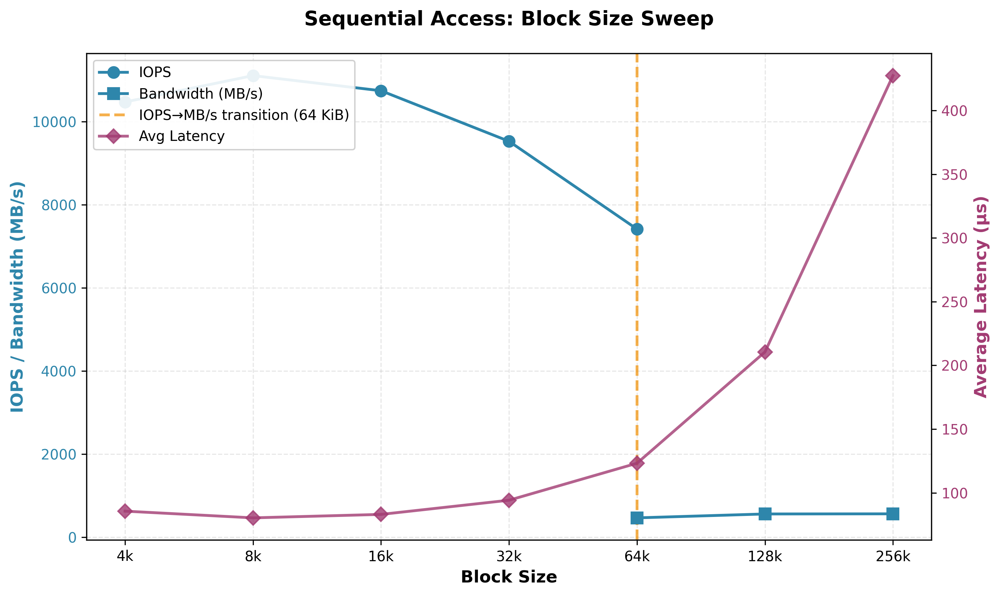
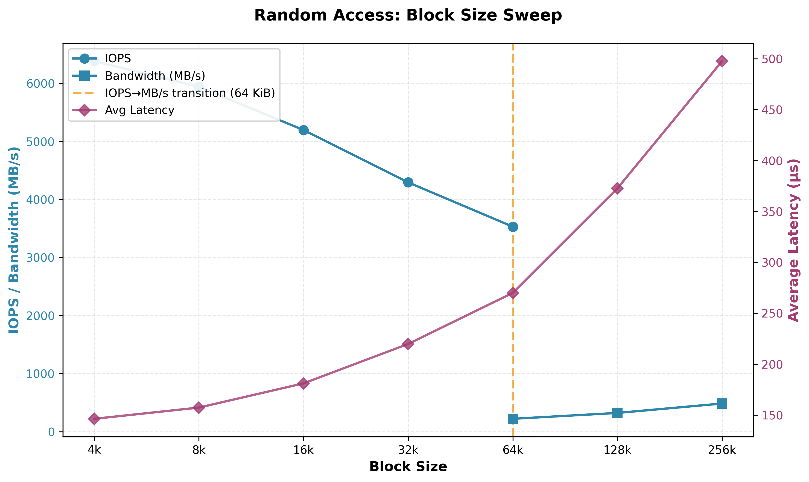
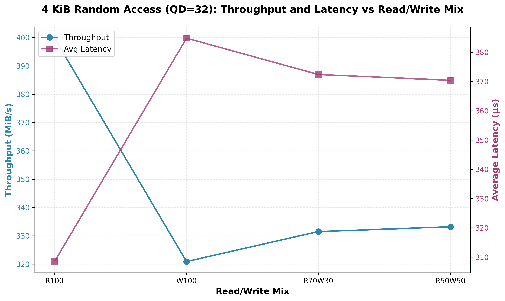
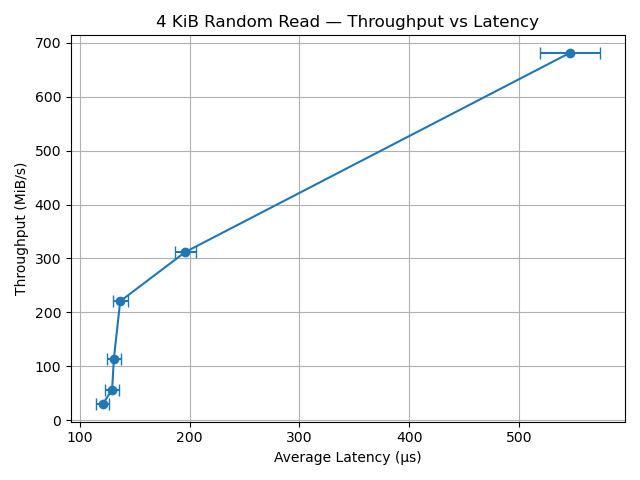

<h1 style="text-align:center;">ACS Project 3 Report</h1>
<h3 style="text-align:center;">Andrew Erickson</h3>

### Introduction 
Modern SSDs can deliver massive amounts of IOPS and GB/s when requests are issued concurrently. Like 
memory, storage exhibits a classic throughput–latency trade-off governed by queuing theory. This report seeks to quantify these trade-offs.

### Experimental set up

CPU: AMD Ryzen 5 PRO 4650U with Radeon Graphics\
Clockspeed: 2.1 GHz \
Turbo Speed: 4.0 GHz \
Cores: 6\
Threads: 12\
Cache per CPU Package: 
- L1 Instruction Cache: 6 x 32 KB
- L1 Data Cache: 6 x 32 KB
- L2 Cache: 6 x 512 KB
- L3 Cache: 8 MB

DRAM: 16 GB (2 x 8 GB) DDR4-3200
OS: Win 10 \
Compiler: g++, version: 13.2.0 \
IDE Used: VSCode

Storage: PCIe NVMe 512GB M.2 2242 SSD

### Section 1 Zero-Queue Baseline:

| Workload           | Avg Latency (µs) | 99th % Latency (µs) | Bandwidth (MB/s) | IOPS   |
|--------------------|------------------|---------------------|------------------|--------|
| 4K RandRead (QD=1) | 57.64            | 152.58              | 55.99            | 14,334 |
| 4K RandWrite (QD=1)| 106.02           | 411.65              | 33.32            | 8,531  |
| 128K SeqRead (QD=1)| 180.30           | 395.26              | 642.93           | 5,143  |
| 128K SeqWrite (QD=1)| 124.91          | 248.83              | 902.97           | 7,224  |

This benchmark data reveals the fundamental performance asymmetries between different I/O patterns and operations on solid-state storage.

Random 4K operations show the lowest latencies (58-106 µs) but also the lowest bandwidth (34-56 MB/s), while sequential 128K operations exhibit higher latencies (125-180 µs) but dramatically superior bandwidth (643-903 MB/s). This counterintuitive result demonstrates that SSDs are optimized for throughput over single-request latency. The larger 128K transfers amortize per-request overhead across more data, achieving 10-16x higher bandwidth despite 2-3x longer individual operation latencies. The IOPS numbers reflect this: 4K random reads achieve 14,334 IOPS while 128K sequential reads manage only 5,143 IOPS, yet deliver far more total data throughput.

Write operations consistently underperform reads across both access patterns. Random writes show 84% higher average latency (106 µs vs 58 µs) and 2.7x worse 99th percentile latency (412 µs vs 153 µs) compared to random reads, achieving only 60% of read bandwidth. This reflects fundamental SSD architecture: writes require erasure of entire blocks before programming, trigger wear-leveling overhead, and must update mapping tables in the flash translation layer. Sequential writes perform better relative to sequential reads (903 MB/s vs 643 MB/s), likely because the SSD can more efficiently batch and schedule sequential write operations to minimize erase overhead.

The 99th percentile latencies reveal significant tail latency issues, particularly for writes. Random writes exhibit 388% worse tail latency than average (412 µs vs 106 µs), indicating occasional stalls probably caused by garbage collection or block erasure operations. This variability poses challenges for latency-sensitive applications where predictable response times matter more than average performance. The relatively tighter tail latencies for sequential operations suggest more predictable behavior when access patterns align with SSD internal parallelism.

### Section 2: Block-size & pattern sweep

  
   
  <em>Figure 1: Sequential Access Block Sweep </em>

  
   
  <em>Figure 2: Random Access Block Sweep </em>

SSD Block Size Sweep Analysis: IOPS-to-Bandwidth Transition\
These graphs reveal how SSD performance characteristics fundamentally shift across block sizes, driven by controller architecture, queue management, and the transition from latency-dominated to throughput-dominated regimes.

The IOPS-to-Bandwidth Crossover (64 KiB Transition)\
The orange vertical line at 64 KiB marks where performance reporting naturally shifts from IOPS to bandwidth metrics, but this transition reflects deeper architectural changes. Below 64 KiB, IOPS decline monotonically (from ~11,000 to ~7,400 for sequential, ~6,400 to ~3,500 for random) as larger blocks require more time per operation. However, bandwidth continues increasing through this range, indicating the controller is still efficiently processing requests. Beyond 64 KiB, IOPS become less meaningful—the focus shifts to sustained throughput where sequential access achieves ~560 MB/s and random reaches ~484 MB/s at 256 KiB. This crossover point represents where per-operation overhead becomes negligible relative to data transfer time.

Prefetching and Queue Coalescing Effects\
Sequential access demonstrates dramatically superior performance in the small block size regime, achieving 64% higher IOPS at 4 KiB (10,475 vs 6,383) compared to random access. This gap reflects aggressive prefetching by the SSD controller—sequential patterns allow the controller to speculatively read ahead and coalesce multiple small requests into fewer, larger NAND flash operations. Modern SSD controllers buffer and reorder requests in their internal queues, merging adjacent sequential reads into single flash transactions. As block size increases, this advantage diminishes; by 256 KiB, sequential bandwidth (560 MB/s) is only 16% higher than random (484 MB/s). Larger blocks naturally amortize prefetch overhead, and the controller's ability to coalesce becomes less impactful when each request already transfers substantial data.

Controller Bandwidth Saturation\
Both access patterns plateau around 480-560 MB/s at large block sizes, revealing fundamental controller or interface limits. Sequential access saturates at ~560 MB/s by 128 KiB and shows no further improvement at 256 KiB, while random access continues climbing to 484 MB/s at 256 KiB. This suggests the sequential workload has hit either the SATA interface limit (~600 MB/s for SATA III) or internal controller bandwidth constraints. The controller can no longer increase throughput regardless of block size—adding more data per operation doesn't help when the data path is already saturated. Random access approaches this same ceiling more gradually because its lower spatial locality creates more controller overhead managing scattered NAND operations.

Latency Implications Across Regimes\
Average latency increases superlinearly with block size (from ~86 µs to ~427 µs for sequential, ~146 µs to ~498 µs for random), but the latency-per-byte actually improves dramatically. At 4 KiB, sequential achieves 21 ns/byte latency (86 µs / 4096 bytes), while at 256 KiB this drops to just 1.6 ns/byte (427 µs / 262144 bytes). This efficiency gain drives the IOPS-to-bandwidth transition: applications caring about latency prefer small blocks and optimize for IOPS, while throughput-oriented workloads use large blocks despite higher absolute latency because bandwidth-per-latency improves. The persistent 40-50% latency penalty for random vs sequential access (even at 256 KiB) confirms that lack of spatial locality forces the controller into less efficient NAND access patterns that cannot be fully masked by buffering.

Critical Insight\
The 64 KiB transition point is not arbitrary—it represents where SSD controller optimizations (prefetching, coalescing, buffering) become saturated and where application concerns shift from minimizing operation count to maximizing bytes-per-operation. Below this threshold, controller intelligence and queue management dominate performance; above it, raw NAND bandwidth and interface limits take over. Understanding this crossover is essential for workload optimization: latency-sensitive applications should use small blocks and focus on queue depth, while bandwidth-intensive workloads should maximize block size to approach controller saturation limits.

### Section 3: Read/Write Mix Sweep

  
   
  <em>Figure 3: Random Access Block Sweep </em>

The results in Figure 3 show a clear difference between pure read, pure write, and mixed workloads. Under pure reads (R100), throughput is highest and latency lowest, since reads can be served directly from flash without the overhead of committing data. In contrast, pure writes (W100) cause throughput to drop sharply and latency to increase significantly. This behavior is explained by flash memory’s inherent write costs: write amplification leads to multiple physical writes per logical operation, garbage collection requires erasing whole blocks before rewriting, and frequent flushes prevent the controller from hiding this overhead. Mixed read/write workloads (R70W30, R50W50) show intermediate performance, with throughput recovering somewhat and latency stabilizing. This improvement is due to the SSD’s use of write buffering and coalescing, where interleaved reads allow the controller to defer or batch flushes, smoothing out write penalties. Overall, the graph illustrates how write amplification and flush behavior make pure writes the most demanding workload, while mixed access patterns benefit from internal optimizations that balance throughput and latency.

In short, the graph shows how SSD controllers handle writes less efficiently than reads due to inherent flash management overheads, but mixed workloads benefit from buffering and reduced flush frequency, softening the penalty compared to pure write workloads.

### Section 4: Queue-depth/parallelism sweep 

  
   
  <em>Figure 4: Throughput vs Latency Knee </em>

The plot shows a classic throughput–latency tradeoff: as average latency rises from ≈120 µs to ≈560 µs, throughput increases from a few tens of MiB/s up to ~680 MiB/s, but the benefit per additional microsecond of latency is not constant.

Little’s Law and the Knee
Little’s Law \(L = \lambda W\) (or, rearranged for throughput:  
\(\text{Throughput} = \lambda \cdot S = \frac{L \cdot S}{W}\)) explains where throughput stops scaling efficiently. For a fixed amount of in-flight work \(L\), throughput scales roughly with \(1/W\).  

The “knee” in the curve appears around **180–200 µs** (throughput ≈300–320 MiB/s). To the left of this point, modest increases in latency yield meaningful throughput gains. To the right, further queueing and device overheads cause much higher latency with diminishing throughput returns.

Diminishing Returns vs Peak Percent
The far right of the curve reaches the measured peak throughput (~680 MiB/s). Points beyond the knee achieve only small additional percentages of that peak while incurring disproportionately higher latency. This reflects diminishing returns: you may reach **80–95% of peak** to the left of the knee, but chasing the last few percent demands a large latency penalty.

Tail-Latency Considerations (p95/p99)
Near or beyond the knee, **tail latency (p95/p99)** typically rises faster than the mean. Even if average throughput looks good, latency-sensitive workloads may see severe slowdowns. This justifies operating **left of the knee** when predictability matters, reserving higher queue depths for bulk or throughput-bound tasks. Explicitly measuring p95/p99 ensures you don’t assume a stable system based solely on average latency.

### Section 5: Anomalies/Limitations

While the results follow expected performance trends, several anomalies and constraints may influence interpretation. First, SSD-internal behaviors—such as garbage collection, background wear leveling, and over-provisioned block recycling—can intermittently inflate latency or depress throughput, particularly under mixed or write-heavy workloads. These effects are stochastic and may not surface consistently across runs. Second, caching and buffering at both the OS and SSD-controller level can temporarily mask true device latency, especially for small queue depths or sequential access patterns. Additionally, thermal throttling or firmware-specific heuristics may contribute to non-linear performance jumps near saturation points. Finally, the measurements rely on average latency and bandwidth; without explicit p95/p99 data across all tests, tail behaviors may be underrepresented, limiting insight into worst-case responsiveness.

### Conclusion

This study quantified how SSD performance scales with access pattern, block size, read/write mix, and queue depth—revealing the trade-offs that govern real-world storage behavior. Small random operations delivered low absolute latency but limited throughput, while large sequential transfers achieved far higher bandwidth by amortizing per-request overhead. A clear IOPS-to-bandwidth crossover emerged around the 64 KiB block size, marking the boundary where controller optimizations give way to interface saturation. Mixed workloads highlighted the write penalty imposed by erase-before-write semantics, write amplification, and flush behavior, with buffering mitigating the impact when reads were interleaved. The queue-depth sweep demonstrated a distinct throughput–latency knee around 180–200 µs, consistent with Little’s Law: beyond that point, additional parallelism yielded marginal throughput gains and disproportionate latency increases. Tail-latency considerations reinforce the importance of operating near or left of this knee for predictable responsiveness. Overall, the results show that SSDs deliver peak efficiency when workloads align with internal parallelism and avoid excessive queue-induced latency, and that understanding these trade-offs is key to tuning both system software and application behavior.